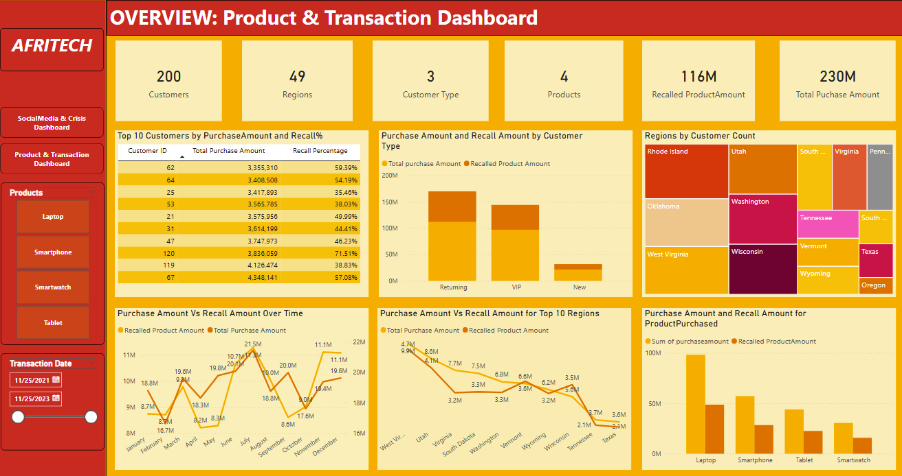
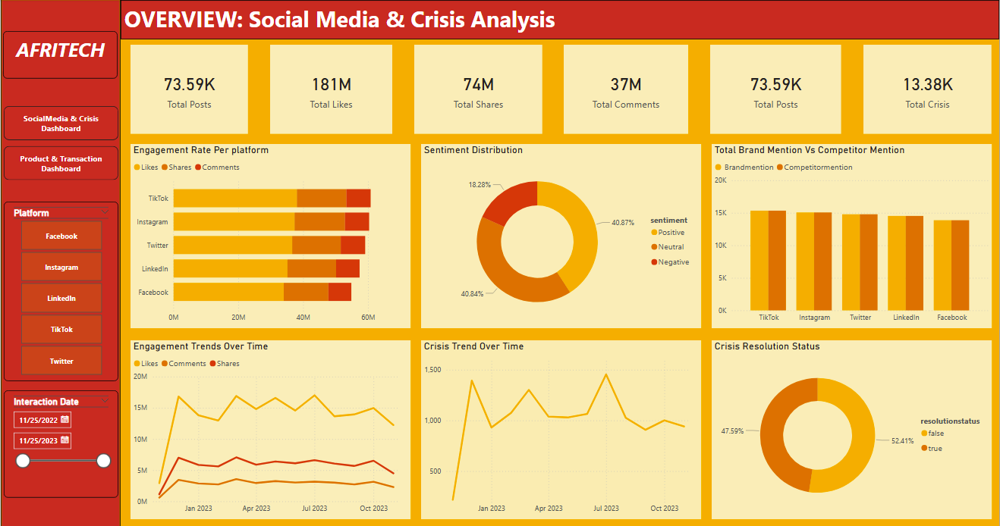

# Afritech-
## 📌 Project Overview
AfriTech Electronics Ltd. faced a significant "Trust Gap" due to rising product recalls and negative social media sentiment. 
This repository contains the PostgreSQL scripts used to engineer the data pipeline, normalize the database schema, 
and perform Exploratory Data Analysis (EDA) to drive the strategic recovery roadmap and PowerBi Visualization to visualize insights, track KPIs, 
and inform actionable strategies to rebuild customer trust and optimize operations.

## Key Challenges:

1. Negative Social Media Buzz: The company is experiencing a surge in negative social media conversations about its products and customer service. These conversations are damaging its brand image.

2. Customer Complaints: Complaints related to product defects, delays in customer support response, and billing issues have been rising, leading to a drop in customer satisfaction.

3. Product Recalls: Recent product recalls have received significant media attention, causing panic among customers and stakeholders.

4. Competitive Pressure: Rivals are gaining market share by exploiting AfriTech Electronics Ltd.’s reputation challenges.

## 🛠️ Technical Workflow
1. Data Collection & Schema Initialization

The raw data was initially ingested into a staging table, AfriTech_Data, capturing raw transactions and social media interactions in a flat file format.

2. Database Normalization (3NF)

To ensure data integrity and reduce redundancy, the flat dataset was normalized into three relational tables:

CustomerData: Stores unique customer profiles and regional demographics.

TransactionData: Tracks financial performance and product integrity (recalls).

SocialMedia: Monitors platform-specific engagement and sentiment metrics.

3. Data Transformation & Cleaning

Key transformations were performed to prepare the data for Power BI integration:

Renaming & Dropping Columns: Standardized TransactionDate to InteractionDate in the social media context and removed redundant transaction fields.

Validation: Performed duplicate checks and handled NULL values in critical fields like CrisisEventTime.

## 📊 Exploratory Data Analysis (EDA) Highlights

Queries were executed to quantify the impact of negative buzz across platforms:

- Aggregated Engagement: Identified platforms with the highest total and average "Likes" and "Comments".

- Sentiment Distribution: Quantified the "Sentiment Neutralization" where negative sentiment (40.84%) rivals positive perception.

- Operational Efficiency (Crisis Response)

- Analyzed the support team's ability to mitigate PR risks:

Response Velocity: Calculated Min, Max, and Average response days (firstresponsetime - crisiseventtime).

- Resolution Audit: Tracked the 47.59% resolution rate against unresolved crisis events.

- Recall Ratio: Aggregated the total PurchaseAmount for recalled products ($116M) vs. successful transactions.

- Regional Analysis: Joined CustomerData and TransactionData to identify top 15 regions by customer volume and recall frequency.

## 📂 Key SQL Scripts
The full script includes:

CREATE TABLE statements for normalization.

INSERT INTO statements with DISTINCT logic for data migration.

Complex CASE statements for Brand vs. Competitor share-of-voice analysis.

Time-series analysis using EXTRACT(MONTH FROM InteractionDate)

## 📊 Power BI Integration

Connectivity: Integrated Power BI Desktop with the PostgreSQL 18 server for real-time data refreshes.

DAX Measures:

Recall Ratio: Recall % = DIVIDE(SUM(TransactionData[PurchaseAmount]), [Total Sales]) where ProductRecalled is TRUE.

Resolution Rate: Percentage of 'True' resolution status vs. 'False' to monitor PR efficiency.

Visualizations:

Regional Treemap: Highlights high-density risk zones like Washington and West Virginia.

Engagement Paradox: Bar charts showing that high-engagement platforms (TikTok/Instagram) harbor the most negative buzz.

## Dashboard Image

## key Recommendations

1. Fix the Quality of Laptops & Phones: These are the biggest sellers but also have the most returns; theres a need to fix the manufacturing issues here first to stop losing money.

2. Focus Support on TikTok & Instagram: Most of the negative comments are happening on these two apps, the team needs to be most active there to reply to customers.

3. Prioritize Top 3 States: Washington, West Virginia, and Utah have the highest number of customers; Afritech should focus repair and apology efforts there to keep your biggest markets happy.

4. Speed Up Response Time :  Currently, over half of customer complaints are ignored or unresolved; there is a need to answer people faster to stop them from going to competitors.

5.Returning and VIP customers spend the most, but product recalls affect them the most too. Offer them extra support or discounts to keep loyalty
